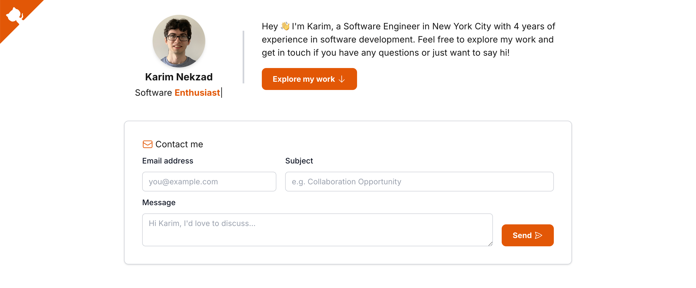

# 💼 Karim Nekzad – Personal Website

This is the source code for my personal portfolio site, built with **Next.js** and styled with **Tailwind CSS**. It's where I showcase my projects, experience, and offer a way to get in touch.

🌐 **Live site**: [karimnekzad.dev](https://www.karimnekzad.dev)

---

## 🚀 Tech Stack

- [Next.js](https://nextjs.org/)
- [Tailwind CSS](https://tailwindcss.com/)
- [TypeScript](https://www.typescriptlang.org/)
- [Vercel](https://vercel.com/) for deployment
- [Cloudflare](https://cloudflare.com/) for DNS + domain

---

## 🧩 Features

- Responsive, fast-loading design
- Custom animated typewriter introduction
- Resume PDF embedded via `react-pdf`
- Accessible contact form via Formspree
- SEO and PWA ready with meta tags and manifest
- Mobile status bar color customization (`oklch`!)

---

## 📬 Contact

If you'd like to connect, reach out via the form on my site or drop me a line on [LinkedIn](https://www.linkedin.com/in/karimnekzad/).
